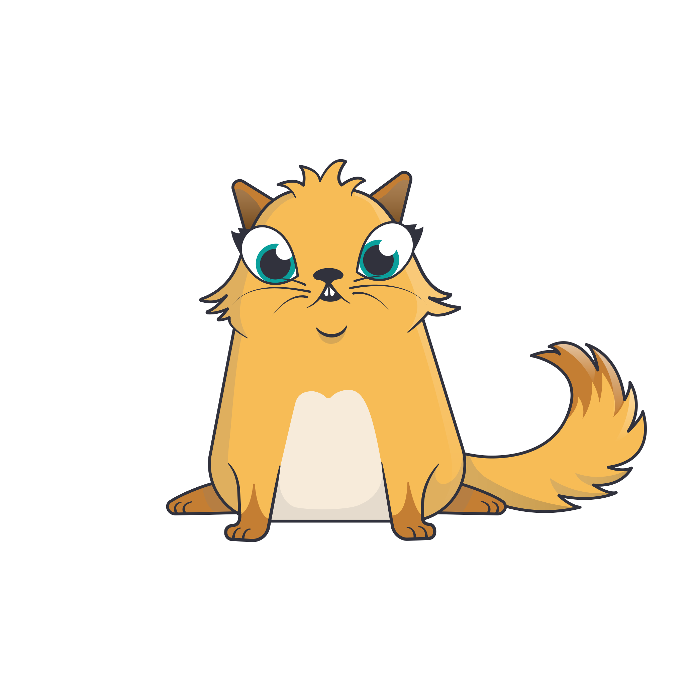

# Crypto Cat Generator

Update previous repository with:

- standalone html page
- CLI generator

No need to run a server. 

Python (3) only.

# How to Use

## CLI

Only need to install bokeh: `pip3 install bokeh`.

For convenience, you can turn the script to executable: `chmod +x CLI_cat.py`

Then, you can generate your cat:

`./CLI_cat.py <shape> <pattern> <eye_shape> <eye_color> ...`

The possible option are reminded by the CLI.

As an example:

`python3 CLI_cat.py gerbil fabulous topaz cymric spock orangesoda kittencream chocolate --path=my_chocolate_cat.svg`

returns this wonderfull cat:



This command is quite long to type.
First, use the `.html` page to find the options that suit to you.


## Html Page

We use [`bokeh`](https://docs.bokeh.org/en/latest/) to generate the html page.
It doesn't support `.svg` image display, so we need to convert all necessary material to `.png`.


### Creating the Resources

First step: `python3 svg_to_png.py extract`.

This would create a `templates/` directory and some other subdirectories to store intermediate svg.

Second step: `python3 svg_to_png.py to_png`.

The script would convert the `.svg` into `.png`. 
The default width is `1000px`, but you can change that with `-W=500` for instance.

In total, it will generate `100MB` of data (for images of 1000 pixels width).


### Making the .html Page

`python3 gen_bokeh_html.py` will create the page `free_cryptocat.html` in the main directory.

The page needs the resources previously generated.
So, if you want to move the page somewhere else, keep files together.

```bash
free_cryptocat.html
templates/
```


You can check the result hosted on my personal website [>> here <<](https://japoneris.neocities.org/assets/images/crypto_cat/free_cryptocat.html).


